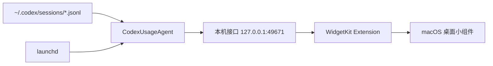

# Codex Usage Widget for macOS

> 原生、轻量、无菜单栏常驻图标的 Codex 用量桌面小组件。

[](https://www.apple.com/macos/)
[](https://www.swift.org/)
[](LICENSE)

<p align="center">
  
</p>

Codex Usage Widget 是一个真正的 macOS WidgetKit 小组件，用来显示 Codex
当前额度的已用比例、剩余比例和重置时间。它不需要 API Key，不读取
`auth.json`，也不会把任何数据发送到第三方服务器。

> This is an unofficial community project and is not affiliated with or endorsed by OpenAI.

## 效果与特性

- 原生 WidgetKit，小组件可直接放在 macOS 桌面或通知中心
- 支持小号和中号布局
- 显示 5 小时、7 天等 Codex 额度窗口
- 显示已用比例、剩余比例和距离重置的时间
- 深色半透明背景，高对比文字，绿色进度圆环
- 独立 `launchd` 后台服务，无菜单栏图标，不常驻运行 App
- 登录时自动启动，异常退出后由 macOS 自动恢复
- 额度数据变化时合并、节流 WidgetKit 刷新请求，避免重复重载
- 数据超过 15 分钟未更新时显示过期状态，不再将旧百分比当作当前额度
- 全部数据仅在本机处理

## 系统要求

- macOS 14 Sonoma 或更高版本
- Apple Silicon Mac
- 已安装并使用 Codex，且本机存在 `~/.codex/sessions`
- 完整版 Xcode（用于构建 WidgetKit 扩展）

## 快速安装

```bash
git clone https://github.com/guoxingtao13/codex-usage-widget.git
cd codex-usage-widget
chmod +x scripts/*.sh
./scripts/install.sh
```

安装脚本会：

1. 构建并签名 App、WidgetKit 扩展和后台服务。
2. 将 App 安装到 `/Applications`；如果没有写入权限，则安装到
   `~/Applications`。
3. 注册 `launchd` 后台服务并立即启动。
4. 向 macOS 注册 WidgetKit 扩展。

安装完成后，在桌面空白处右键选择“编辑小组件”，搜索 **Codex 用量**，
选择小号或中号布局即可。

### 升级已有安装

在此前克隆的仓库目录运行：

```bash
git pull --ff-only
./scripts/install.sh
```

安装脚本会重新构建 App 和扩展、替换现有安装并重启后台服务；通常不必从桌面
移除并重新添加小组件。安装后可运行
`curl http://127.0.0.1:49671/snapshot` 检查本机服务是否返回新数据。
如果小组件画面仍未更新，请等待 macOS 安排的下一次重绘；必要时参照下方的
“常见问题”检查后台服务和小组件注册状态。

### 自定义签名

脚本会优先使用钥匙串中的 Apple Development 或 Developer ID Application
证书；如果不存在，则回退到本机临时签名。也可以显式指定：

```bash
CODEX_WIDGET_SIGNING_IDENTITY="Apple Development: Your Name (TEAMID)" \
CODEX_WIDGET_DEVELOPMENT_TEAM="TEAMID" \
./scripts/install.sh
```

## 工作原理



`CodexUsageAgent` 每 4 秒检查一次最近的 Codex 会话日志：

- 只检查最近 7 天的目录
- 最多处理最近修改的 20 个 JSONL 文件
- 每个文件最多读取末尾 4 MB
- 使用文件大小和修改时间缓存，未变化的文件不会重复解析
- 额度快照变化时合并、节流 WidgetKit 重载请求

小组件还会安排后续时间线刷新，并将额度数据的 15 分钟有效期纳入时间线：
超过有效期仍未收到新快照时显示过期状态，不继续把旧百分比标为当前用量。
后台每 4 秒检查日志不等于桌面每 4 秒重绘；WidgetKit 的实际刷新时机由
macOS 决定，也可能因系统负载延迟。因此这是“接近实时”显示，不保证实时。
数据源仍是本机 Codex 会话日志，并非直接查询在线账户额度；若 Codex
近期没有写入新的额度事件，小组件会提示数据过期。

## 2.1.0 更新说明

- 修复旧额度长时间停留在小组件上的问题：加入数据有效期和过期提示。
- 在时间线中提前安排数据到期后的状态更新，减少旧画面滞留。
- 合并、节流数据变化触发的刷新请求，降低重复重载。

目前按上述源码安装方式发布，需要本机安装完整版 Xcode。尚未提供经
Developer ID 签名和 Apple 公证的免编译二进制安装包；下载未知来源的
App 压缩包并不能替代这一步。

## 隐私

本项目：

- 仅读取 `~/.codex/sessions` 中的额度事件
- 不读取 `~/.codex/auth.json`
- 不读取或保存 API Key、Access Token、提示词和回复正文
- 不连接第三方服务器
- 只通过 `127.0.0.1:49671` 在本机后台服务和小组件之间传递额度 JSON

本机接口只包含额度百分比、额度窗口、重置时间和 Credits 余额。

## 开发

构建：

```bash
DEVELOPER_DIR=/Applications/Xcode.app/Contents/Developer \
./scripts/package-app.sh
```

构建产物位于：

```text
dist/Codex 用量.app
```

运行测试：

```bash
DEVELOPER_DIR=/Applications/Xcode.app/Contents/Developer \
PATH=/Applications/Xcode.app/Contents/Developer/Toolchains/XcodeDefault.xctoolchain/usr/bin:$PATH \
swift test --parallel
```

主要组件：

| 组件 | 作用 |
| --- | --- |
| `CodexUsageWidgetExtension` | WidgetKit UI 和时间线 |
| `CodexUsageAgent` | 扫描日志、解析额度并提供本机接口 |
| `launchd` LaunchAgent | 登录时启动并守护后台服务 |
| `Codex 用量.app` | 承载 WidgetKit 扩展，不需要常驻运行 |

## 常见问题

### 小组件显示“等待 Codex 数据”

先确认 Codex 最近产生过会话日志，然后检查本机接口：

```bash
curl http://127.0.0.1:49671/snapshot
```

如果后台服务没有运行：

```bash
launchctl kickstart -k "gui/$(id -u)/local.codex.usage-agent"
```

必要时刷新 WidgetKit：

```bash
killall chronod
killall NotificationCenter
```

### 小组件库里搜索不到

确认 App 没有被移走，然后重新注册扩展：

```bash
pluginkit -a "/Applications/Codex 用量.app/Contents/PlugIns/CodexUsageWidgetExtension.appex"
```

如果安装在用户应用目录，请把路径改为
`~/Applications/Codex 用量.app/...`。

## 卸载

```bash
./scripts/uninstall.sh
```

卸载脚本会停止后台服务、移除 LaunchAgent，并删除安装的 App。它不会删除
任何 Codex 会话数据。

## 路线图

- 英文界面与本地化
- 可选择的刷新频率
- 更丰富的中号布局
- 发布 Developer ID 签名并经 Apple 公证的可下载安装包

欢迎提交 Issue 和 Pull Request。

## License

[MIT](LICENSE)
